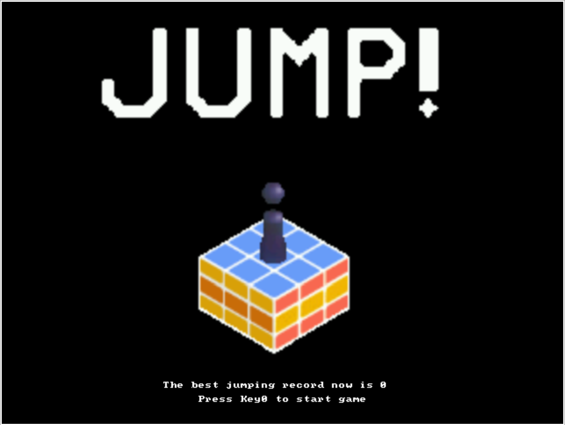

# JUMP

## Introduction

University of Toronto ECE243 Final Open software project. 

Inspired by the famous Wechat game, [Tiaoyitiao](https://baike.baidu.com/item/%E8%B7%B3%E4%B8%80%E8%B7%B3/22302702).
The .c file can be executed on the website [CPUlator](https://cpulator.01xz.net/?sys=arm-de1soc) and is designed to work on the DE1SOC board.  

This software animation project received a final mark of **10/10**.

## Key I/O Features

### push button `Key0`
Use I/O pulling to determine pushing and releasing motion from user

### power bar `LED0-9`
LED0-9 will lighten up in order (from 0-9) to show that power is accumulated by the character for the next jump. Once maximum power is reached, the power bar will blink rapidly to show that full power is being applied to the character.

### Seven-segment displays `7SEG display 0-4`
7-SEG displays 0-4 are used for the following features:
- `JUMP` opening 7-seg display
- current jumping record display

### character buffer
character buffers are used for the following features:
- game instruction (key pressing)
- printing best jumping record at the start of game round

_note that character buffer requires its own clearing method (cannot be cleared with the VGA buffer)_

### 2.5D animation `VGA double pixel buffer`
VGA visual display is used for game animation as follows:
- `JUMP!` title floating animation
- character jumping animation
- character distortion animation
- blocking moving animation
- jumping success particle splash animation
- game complete looping animation
